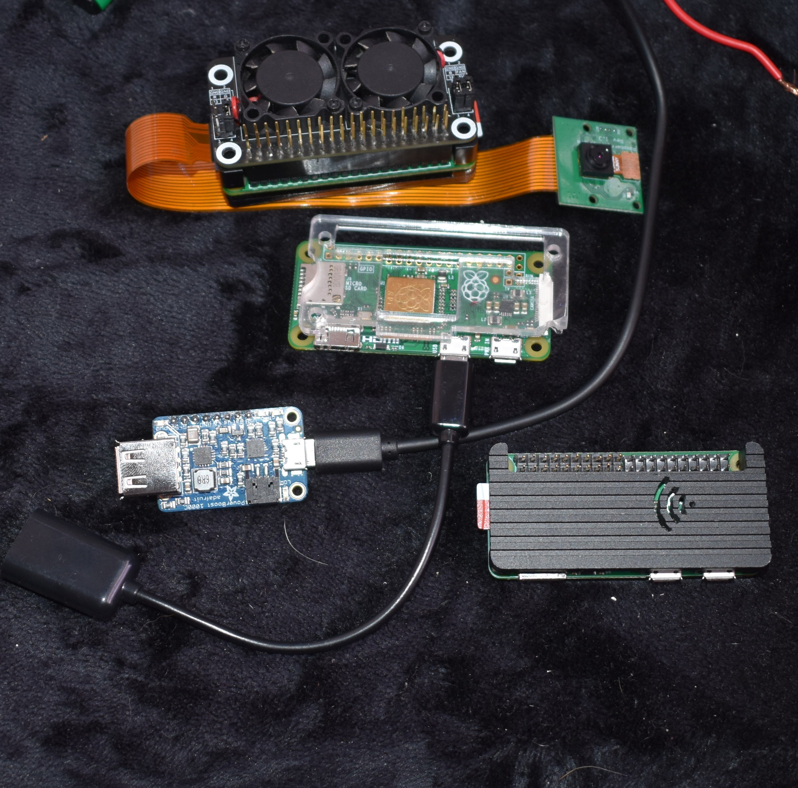

# Pi-Dash
___________________

 

Say hello to the world of DIY recording, and introduce yourself to your own DIY dashcam built and ported to a raspberry pi.

A DIY Dashcam using Raspberry Pi Zero W and Pi Camera Module V2.1!

# Overview
The pi dash was designed to simplify data collection, and teach you how to not only code your own recording device from the endless capabilities of a raspberry Pi!  

With this, you will be able to go past the basic functionalities and limits of pre-built dashcams
and integrate your own solutions and features that extensive data collection and recording can provide.

With the tutorial, you will be able to build your own dashcam that **records and stores video files in a location of your preference.** The project is designed to be a simple, easy-to-follow guide to building a DIY dashcam using a Raspberry Pi Zero. The project is aimed at beginners and hobbyists who are interested in learning relevant implementations of DIY applications.

Also, by following this tutorial, you will learn about the basics of machine learning and computer vision, and how to apply these concepts to a real-world project. The project is designed to be a fun and engaging way to learn about these topics, and to inspire you to explore them further.

Now let's take a look at what you’ll find in this repository. Each section has further details on how to build your own Pi-Dash, and how to hack and remix it for your own projects. Please be sure to follow the links to the relevant sections for more information.
 
 

# Directory Structure 
-------------------------------------
-  **[1. Assembling and Gathering Components](hardware/Electronics/1.0_Gathering-All-Necessary-Components.md)** -
Explaining functionality through prototype build through easy-to-follow tutorial aimed at how the project is working

-  **[2. Setting up the RPI Image](software/2.0_Configuring-The-RPI-Image.md)** -
Explaining functionality through prototype build through easy-to-follow tutorial aimed at how the project is working

-  **[3. Setting up and testing pi dashcam for automatic recordings of preferred length](software/bullseye-bookworm_picamera2/python/record_10_secs/3.0_Software-Configuring-and-Testing.md)** -
An easy-to-follow software overview of services set on rpi to make automatic recording of camera whenever you turn on the device.
- **[4.  printing out the case for all your components(OPTIONAL) ](hardware/Casing/4.0_Printing-Case.md)** -
A set of simple experiments to help understand how Alto works, and how you can use Alto to introduce some of the basic concepts of machine learning to others.

- **[5. Putting together the device with the car mounting equipment.Setting up your device in your car for aesthetic build](hardware/Mount/5.0_Attaching-The-Car-Mount.md)** -
A brief introduction to how you can hack your Alto to look and behave differently to fit your own application.

## [Remixing Pi-Dash for your projects](remixing-pi-dash.md)

All the hardware and software for Pi-Dash was created with hacking and remixing in mind: the case design can be made from different materials, or refactored entirely; the electronics can be adapted to use whatever components you have available;and the software is written in a high level language (Python) with optional bash scripts that are easy to modify. 

<!-- TODO: add either mit license or cc license 
# License
____________________
This project is licensed under the MIT License - see the [LICENSE.md](LICENSE.md) file for details
-->

# Acknowledgments
____________________

Raspberry Pi is a trademark of Raspberry Pi Ltd
(See [Website](https://www.raspberrypi.org/))

# Built With
- [PiCamera](https://picamera.readthedocs.io/en/release-1.13/)
- [OpenCV](https://opencv.org/)
- [Python](https://www.python.org/)
- [Bash](https://www.gnu.org/software/bash/)
  

