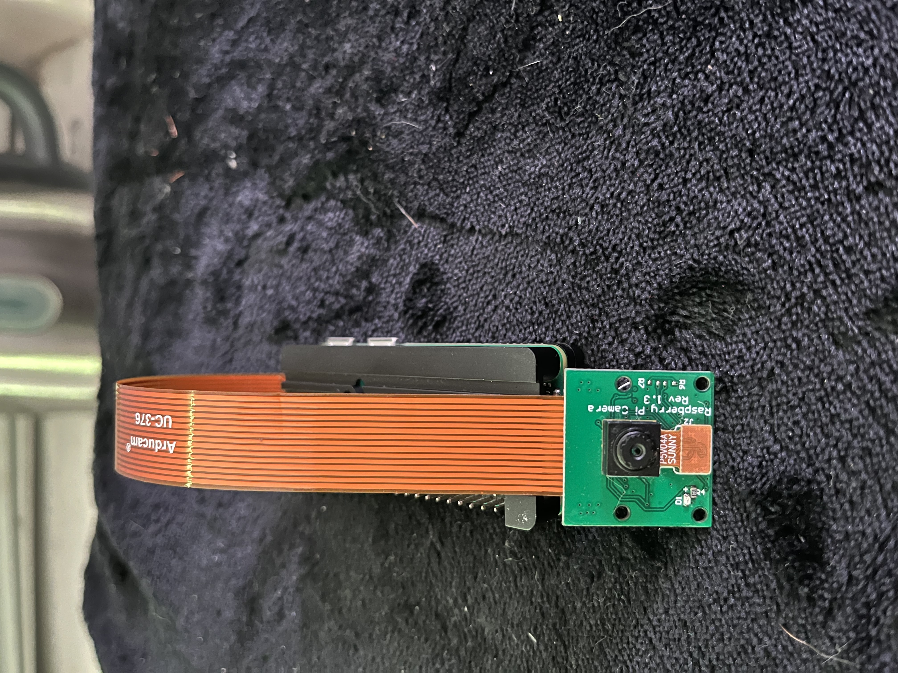

# Configuring and Testing the Software
---------------------------


This section will guide you through the process of configuring and testing the software for the DIY Dashboard project. 


The software is responsible for recording videos using the Raspberry Pi Zero and camera module. The software is designed to be easy to use, so you can start recording videos with the Raspberry Pi Zero in no time. Let's get started!

> **Notes**: 
> - If you have already used the custom image, you can skip to the section on [Starting Recording Videos](#step-3-start-recording-videos).
> - The software is written in Python and uses the `picamera2` latest library to interface with the camera module (`libcamera` library).
> link to the [picamera2](https://github.com/raspberrypi/picamera2.git) GitHub repository.
> 


**Included in this section are instructions on how to**:

1. **Install the ribbon cable and camera module**
2. **Clone the repository to the Raspberry Pi Zero**
3. **Configure the software for the DIY Dashboard project**
4. **Start recording videos with the Raspberry Pi Zero**
5. **Explanation of the code, variables, and python modules**
6. **Enable automatic recording on boot**
7. **Script to enable automatic recording on boot**
8. **Additional functionality**
9. **Conclusion**
10. 
11. **Configure the software from the repository on the Raspberry Pi Zero** (cloning isn't necessary for those who have already used the custom image)
12. **Start recording videos with a sample script**
13. **Explanation of the code, variables, and python modules**
14. Explanation of how automatic recording is enabled
15. Script to enable automatic recording on boot


## Prerequisites
### Installing the ribbon cable and camera module
<!-- TODO: Add image of the ribbon cable and camera module -->

The Raspberry Pi Zero has a camera connector that allows you to connect a camera module to the Raspberry Pi Zero. The camera connector is a 15-pin ribbon cable that connects the camera module to the Raspberry Pi Zero. The camera module is a small camera that can be used to capture images and video on the Raspberry Pi Zero.


Here are the steps to install the ribbon cable and camera module on the Raspberry Pi Zero:

1.  Insert the ribbon cable into the camera connector on the Raspberry Pi Zero. The camera connector is located between the HDMI port and the micro USB power port on the Raspberry Pi Zero.
2.  Make sure the ribbon cable is inserted correctly and is secure in the camera connector.
3.  Connect the camera module to the other end of the ribbon cable. The camera module has a small connector that plugs into the ribbon cable.
4.  Make sure the camera module is connected correctly and is secure in the ribbon cable.
5.  Power on the Raspberry Pi Zero and test and we will test the camera module in the next section.

The ribbon cable and camera module are now installed on the Raspberry Pi Zero. You can now test the camera module to make sure it is working correctly.

### Step 0: Testing the camera module
<!-- TODO: Add terminal commands gif to test the camera module -->
We need to download the `picamera2` library to interface with the camera module. The `picamera2` library is a Python library is a picamera library suited for bulls-eye and later versions of the Raspberry Pi OS using the libcamera library. You can install the `picamera2` library by running the following command:

```bash
sudo apt-get update
sudo apt-get install python3-picamera2

```
>Note:
> - The latest 64-bit Raspberry Pi OS (Bullseye) uses the `libcamera` library to interface with the camera module.This means that `picamera2` is already installed on the Raspberry Pi Zero 2 W Lite version by default.

Once you have installed the `picamera2` library, you can test the camera module by running the following command:
<!-- TODO: Add terminal commands gif to test the camera module -->
```bash
libcamera-still -o image.jpg
```

This command will capture an image with the camera module and save it as `image.jpg` in the current directory. You can view the image by opening it with an image viewer.

You can also test the camera module by running the following command:

```bash
libcamera-vid -o video.h264
```


This command will capture a video with the camera module and save it as `video.h264` in the current directory. You can view the video by converting it to a playable format using the `MP4Box` tool.

The camera module is now installed and tested on the Raspberry Pi Zero. You should be able to capture images and videos with the camera module using the `picamera2` library. Let's move on to configuring the software for the DIY Dashboard project.

## Step 1: Clone the Repository and open the software directory
1. First, you need to clone the repository to your Raspberry Pi Zero. To do this, plug in your external keyboard and run the following command:

```bash
cd ~/
```

2. Next, clone the repository to your Raspberry Pi Zero by running the following command:

```bash
git clone https://github.com/Robjects-Pi/Pi-Dash.git
```


This will clone the repository to your Raspberry Pi Zero home directory. You can now navigate to the `Pi-Dash` directory by running the following command:
    
```bash
cd Pi-Dash
```
<br>

>Note: If you do not have Git installed on your Raspberry Pi Zero, you can install it by running the following command:
`sudo apt-get install git`


## Step 2: Configure the Software for the DIY Dashboard Project


1. Next, you need to configure the software for the DIY Dashboard project. Change to the `Software` directory by running the following command:

```bash
cd ~/Pi-Dash/Software/bullseye-bookworm_picamera2/python/start_recording
```

2. Run the setup script to install the required dependencies and set up the software for the DIY Dashboard project. To run the setup script, run the following command:

```bash
sudo ./Setup/setup.sh
```

The setup script will install the required dependencies and set up the software for the DIY Dashboard project. You can now start recording videos with the Raspberry Pi Zero.

<!-- TODO: #24 Test functionality of the setup script -->


## Step 3: Start Recording Videos
1. Change to the `Software` directory by for your os by running the following command:

```bash
cd Pi-Dash/software/{OS_VERSION}/testing_with_picamera2/
```

2. Run the record script to start recording videos. The script will start recording and save the video files in the `videos` directory. The script will run until you stop it by pressing `Ctrl+C`. To run the script, run the following command:

```bash
python3 start_recording.py
```

The script will start recording videos with the Raspberry Pi Zero. You can now start recording videos with the Raspberry Pi Zero.

To stop the recording, press `Ctrl+C`. ~~The video files will be saved in the `videos` directory.~~


## Step 4: Explanation of the Code
The code for the DIY Dashboard project is written in Python and uses the `picamera2` library to interface with the camera module. The code is designed to be simple and easy to understand, so you can easily modify it to suit your needs.

The code is divided into two main parts: the setup code and the recording code. The setup code initializes the camera module and sets up the recording parameters, while the recording code captures images and videos with the camera module.

Here is an explanation of the code:

1. **Setup Code**: The setup code initializes the camera module and sets up the recording parameters. The setup code is responsible for setting up the camera module and configuring the recording parameters. The setup code is run once at the beginning of the script.
2. **Recording Code**: The recording code captures images and videos with the camera module. The recording code is responsible for capturing images and videos with the camera module. The recording code is run in a loop to continuously capture images and videos with the camera module.
3. **Variables**: The code uses variables to store the camera module settings and recording parameters. The variables are used to configure the camera module and set up the recording parameters. The variables are defined at the beginning of the script and are used throughout the script.
4. **Python Modules**: The code uses the `picamera2` library to interface with the camera module. The `picamera2` library is a Python library that provides a simple interface for capturing images and videos with the camera module. The code also uses other Python modules to control the camera module and save the video files.
5. **Recording Parameters**: The code sets up the recording parameters, such as the resolution, frame rate, and duration of the video. The recording parameters are used to configure the camera module and set up the recording parameters. The recording parameters are defined at the beginning of the script and are used throughout the script.
6. **Recording Loop**: The code uses a loop to continuously capture images and videos with the camera module. The recording loop is responsible for capturing images and videos with the camera module. The recording loop runs continuously until you stop it by pressing `Ctrl+C`.
7. **Saving Video Files**: The code saves the video files in the `videos` directory. The video files are saved in the `videos` directory and can be accessed at any time. The video files are saved in the `videos` directory with a unique name based on the date and time of the recording.
8. **Stopping the Recording**: To stop the recording, press `Ctrl+C`. The recording will stop and the video files will be saved in the `videos` directory. You can access the video files at any time and view them with an image viewer or video player.
9. **Modifying the Code**: You can modify the code to suit your needs. You can change the recording parameters, such as the resolution, frame rate, and duration of the video. You can also add additional functionality to the code, such as sending the video files to a server or external USB drive.
10. **Starting the Recording**: To start the recording, run the script by running the following command:

```bash
python3 start_recording.py
```

The script will start recording videos with the Raspberry Pi Zero. You can now start recording videos with the Raspberry Pi Zero.

## Step 5: Enable Automatic Recording on Boot
1. Copy the `record.service` file to the `/etc/systemd/system/` directory by running the following command:

```bash
sudo cp record.service /etc/systemd/system/
```

2. Reload the systemd manager configuration by running the following command:

```bash
sudo systemctl daemon-reload
```

3. Enable the service to start on boot by running the following command:

```bash
sudo systemctl enable record.service
```

4. Start the service by running the following command:

```bash
sudo systemctl start record.service
```

5. Check the status of the service by running the following command:

```bash
sudo systemctl status record.service
```

The service should be running and the camera should be recording. The video files will be saved in the `videos` directory.

6. To stop the service, run the following command:

```bash
sudo systemctl stop record.service
```

7. To disable the service from starting on boot, run the following command:

```bash
sudo systemctl disable record.service
```

8. To remove the service, run the following command:

```bash
sudo rm /etc/systemd/system/record.service
```

The software is now configured and you can start recording videos with the Raspberry Pi Zero. The videos will be saved in the `videos` directory and you can access them at any time.

## Additional functionality
I have included additional scripts in the `extra-features` directory that you can use to test the functionality of the camera module. The scripts include:
- `detect_power_loss.py`: A script that detects when the power is lost and shuts down the Raspberry Pi Zero safely using a battery backup. This script is useful for preventing data corruption when the power is lost, and for ensuring that the Raspberry Pi Zero shuts down safely.
- `send_to_server.py`: A script that sends video files to a online server. You can possibly use this in combination with the previous script to send the video files to a server when the power is lost. This script is useful for backing up your video files and for accessing them remotely.
- `sync_to_usb.py`: A script that syncs video files to an external USB drive. This script is useful for backing up your video files and for accessing them remotely.
- `offline_sync_to_server.py`: A script that syncs video files to a server or external USB drive when the Raspberry Pi Zero is offline. This script is useful for backing up your video files and for accessing them remotely.
- `offline_sync_to_server.sh`: A bash script that syncs video files to a server or external USB drive when the Raspberry Pi Zero is offline. This script is useful for backing up your video files and for accessing them remotely.
- `offline_sync_to_server.service`: A systemd service that syncs video files to a server or external USB drive when the Raspberry Pi Zero is offline. This script is useful for backing up your video files and for accessing them remotely.
- `LED.py`: A script that controls an LED connected to the Raspberry Pi Zero. This script is useful for indicating the status of the Raspberry Pi Zero, such as when it is recording or when the power is lost.


## Conclusion
Now that you have configured the software for the DIY Dashboard project, you can start working on the assembly of the project. The next section will guide you through the process of printing the case for all your components. Let's get started!
