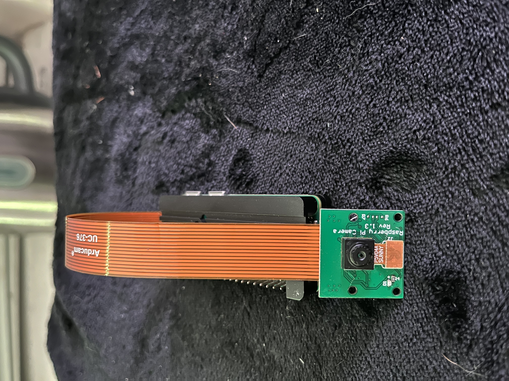

# Configuring and Testing the Software
---------------------------


This section will guide you through the process of configuring and testing the software for the DIY Dashboard project. 


The software is responsible for recording videos using the Raspberry Pi Zero and camera module. The software is designed to be easy to use, so you can start recording videos with the Raspberry Pi Zero in no time. Let's get started!

> **Notes**: 
> - The software is written in Python and uses the `picamera2` latest library to interface with the camera module (`libcamera` library).
> link to the [picamera2](https://github.com/raspberrypi/picamera2.git) GitHub repository.
> 


**Included in this section are instructions on how to**:

1. **Install the ribbon cable and camera module**
2. **Clone the repository to the Raspberry Pi Zero**
3. **Configure the software for the DIY Dashboard project**
4. **Start recording videos with the Raspberry Pi Zero**
5. **Explanation of the code, variables, and python modules**
6. **Enable automatic recording on boot**
7. **Script to enable automatic recording on boot**
8. **Additional functionality**
9. **Conclusion**
10. **Configure the software from the repository on the Raspberry Pi Zero** 
11. **Start recording videos with a sample script**
12. **Explanation of the code, variables, and python modules**
13. Explanation of how automatic recording is enabled
14. Script to enable automatic recording on boot


## Prerequisites
### Installing the ribbon cable and camera module
<!-- TODO: Add image of the ribbon cable and camera module -->

The Raspberry Pi Zero has a camera connector that allows you to connect a camera module to the Raspberry Pi Zero. The camera connector is a 15-pin ribbon cable that connects the camera module to the Raspberry Pi Zero. The camera module is a small camera that can be used to capture images and video on the Raspberry Pi Zero.


Here are the steps to install the ribbon cable and camera module on the Raspberry Pi Zero:

1.  Insert the ribbon cable into the camera connector on the Raspberry Pi Zero. The camera connector is located between the HDMI port and the micro USB power port on the Raspberry Pi Zero.
2.  Make sure the ribbon cable is inserted correctly and is secure in the camera connector.
3.  Connect the camera module to the other end of the ribbon cable. The camera module has a small connector that plugs into the ribbon cable.
4.  Make sure the camera module is connected correctly and is secure in the ribbon cable.
5.  Power on the Raspberry Pi Zero and test and we will test the camera module in the next section.

The ribbon cable and camera module are now installed on the Raspberry Pi Zero. You can now test the camera module to make sure it is working correctly.

### Step 0: Testing the camera module
<!-- TODO: Add terminal commands gif to test the camera module -->
We need to download the `picamera2` library to interface with the camera module. The `picamera2` library is a Python library is a picamera library suited for bulls-eye and later versions of the Raspberry Pi OS using the libcamera library. You can install the `picamera2` library by running the following command:

```bash
sudo apt-get update
sudo apt-get install python3-picamera2

```
>Note:
> - The latest 64-bit Raspberry Pi OS (Bullseye) uses the `libcamera` library to interface with the camera module.This means that `picamera2` is already installed on the Raspberry Pi Zero 2 W Lite version by default.

Once you have installed the `picamera2` library, you can test the camera module by running the following command:
<!-- TODO: Add terminal commands gif to test the camera module -->
```bash
libcamera-still -o image.jpg
```

This command will capture an image with the camera module and save it as `image.jpg` in the current directory. You can view the image by opening it with an image viewer.

You can also test the camera module by running the following command:

```bash
libcamera-vid -o video.h264
```


This command will capture a video with the camera module and save it as `video.h264` in the current directory. You can view the video by converting it to a playable format using the `MP4Box` tool.

The camera module is now installed and tested on the Raspberry Pi Zero. You should be able to capture images and videos with the camera module using the `picamera2` library. Let's move on to configuring the software for the DIY Dashboard project.

## Step 1: Clone the Repository and open the software directory
1. First, you need to clone the repository to your Raspberry Pi Zero. To do this, plug in your external keyboard and run the following command:

```bash
cd ~/
```

2. Next, clone the repository to your Raspberry Pi Zero by running the following command:

```bash
git clone https://github.com/Robjects-Pi/Pi-Dash.git
```


This will clone the repository to your Raspberry Pi Zero home directory. You can now navigate to the `Pi-Dash` directory by running the following command:
    
```bash
cd Pi-Dash
```
<br>

>Note: If you do not have Git installed on your Raspberry Pi Zero, you can install it by running the following command:
`sudo apt-get install git`


## Step 2: Configure the Software for the DIY Dashboard Project


1. Next, you need to configure the software for the DIY Dashboard project. Change to the `Software` directory by running the following command:

```bash
cd ~/Pi-Dash/software/bullseye-bookworm_picamera2/python/start_recording
```

2. We need to change the permissions of the setup script to make it executable. To do this, run the following command:

```bash
sudo chmod +x setup_script/setup.sh
```

This will make the setup script executable. You can now run the setup script to install the required dependencies and set up the software for the DIY Dashboard project.


3. Run the setup script to install the required dependencies and set up the software for the DIY Dashboard project. To run the setup script, run the following command:

```bash
sudo ./setup_script/setup.sh
```

The setup script will install the required dependencies and set up the software for the DIY Dashboard project. You can now start recording videos with the Raspberry Pi Zero.

<!-- TODO: #24 Test functionality of the setup script -->
Lastly, let's go ahead and change the permissions of the start recording script to make it executable. To do this, run the following command:

```bash
sudo chmod +x start_recording.py
sudo chmod +x stop_recording.py
```

This will make the start recording script executable. You can now start recording videos with the Raspberry Pi Zero.


## Step 3: Start Recording Videos
1. Change to the `Software` pertaining to your OS directory by running the following command:

```bash
cd ~/Pi-Dash/software/bullseye-bookworm_picamera2/python/start_recording
```
For the `Raspbian_picamera` directory, run the following command:
```bash
cd ~/Pi-Dash/software/Raspbian_picamera/record-10-secs
```


1. Run the record script to start recording videos ('start_recording.py' for the `bullseye-bookworm_picamera2` directory and 'record-10-secs.py' for the `Raspbian_picamera` directory). The script will start recording and save the 10 second video files in the `videos` directory. The script will run for 10 seconds and stop automatically or you can stop it by pressing `Ctrl+C`. To run the script, run the following command:

```bash
python3 record-10-secs.py
```
For the `Raspbian_picamera` directory, run the following command:
```bash
python3 record-10-secs.py
```

The script will start recording videos with the Raspberry Pi Zero. You can now start recording videos with the Raspberry Pi Zero.


## Step 4: Explanation of the Code
The code for the DIY Dashboard project is written in Python and uses the `picamera2` library to interface with the camera module. The code is designed to be simple and easy to understand, so you can easily modify it to suit your needs.

The code is responsible for recording videos with the Raspberry Pi Zero and camera module. The code captures images and videos with the camera module and saves the video files in the `videos` directory. The code is designed to be easy to use, so you can start recording videos with the Raspberry Pi Zero in no time.

Following is an explanation of the code, variables, and Python modules used in the code:

```python
import picamera2
import datetime
import os

# Set up the camera module
camera = picamera2.PiCamera()

# Set up the recording parameters
camera.resolution = (640, 480)
camera.framerate = 24
camera.start_recording('videos/video.h264')

try:
    while True:
        camera.wait_recording(1)
except KeyboardInterrupt:
    camera.stop_recording()
    camera.close()
```

The code is written in Python and uses the `picamera2` library to interface with the camera module. The code is designed to be simple and easy to understand, so you can easily modify it to suit your needs.

The `python` is split into three main sections with information about the contents listed below:
1.  `record_10_secs`:
    
    Directory containing a Python script `record-10-secs.py` that records 10 seconds of video with the camera module and saves the video file in the `videos` directory. PLEASE run the setup and then test THIS SCRIPT before running the `start_recording.py` script.

2.  `start_recording`: 

    Directory containing a Python script `stop_recording.py` and `start_recording.py` that starts the recording of the video file. 
   Python script that stops the recording of the video file.
3. `additional-features`: 
   
   Directory containing additional scripts for testing the functionality of the camera module across the many features of the picamera2 library. Please note that these scripts are not part of the main functionality of the DIY Dashboard project, and have not been tested for the project. I have provided them for your reference and testing purposes.
   
It is recommended to test these scripts separately before using them in the project.
module.
  


## Step 5: Enable Automatic Recording on Boot
1. To enable automatic recording on boot, you need to create a systemd service that starts the recording script when the Raspberry Pi Zero boots up. To do this, create a new systemd service file by running the following command:

```bash
sudo nano /etc/systemd/system/record.service
```

2. Add the following lines to the systemd service file:

```bash
[Unit]
Description=Record video on boot
After=multi-user.target

[Service]
Type=simple
ExecStart=/usr/bin/python3 /home/pi/Pi-Dash/software/bullseye-bookworm_picamera2/python/start_recording/start_recording.py
Restart=on-failure

[Install]
WantedBy=multi-user.target
```
Flags:
- `Description`: A description of the service.
- `After`: The target unit that the service should start after.
- `Type`: The process type of the service.
- `ExecStart`: The command to start the service.
- `Restart`: The restart policy of the service.
- `WantedBy`: The target unit that the service should be enabled for.
- `ExecStart`: The command to start the service.
- `Restart`: The restart policy of the service.
- `WantedBy`: The target unit that the service should be enabled for.


3. Save the systemd service file by pressing `Ctrl+X`, then `Y`, and then `Enter`.
4. Reload the systemd manager configuration by running the following command:

```bash
sudo systemctl daemon-reload
```

5. Enable the service to start on boot by running the following command:

```bash
sudo systemctl enable record.service
```

The service is now configured to start recording videos automatically when the Raspberry Pi Zero boots up. You can now start the service and check the status of the service.

## Step 6: Start the Service and Check the Status

1. Start the service by running the following command:

```bash
sudo systemctl start record.service
```

2. Check the status of the service by running the following command:

```bash
sudo systemctl status record.service
```

The service should be running and the camera should be recording. The video files will be saved in the `videos` directory.

3. To stop the service, run the following command:

```bash
sudo systemctl stop record.service
```

4. To disable the service from starting on boot, run the following command:

```bash
sudo systemctl disable record.service
```

5. To remove the service, run the following command:

```bash
sudo rm /etc/systemd/system/record.service
```

The software is now configured and you can start recording videos with the Raspberry Pi Zero. The videos will be saved in the `videos` directory and you can access them at any time.

## Additional functionality 
In addition to the main functionality of the DIY Dashboard project, I included some ideas for additional functionality that you can use to enhance the project. The additional functionality includes scripts. I would love to see a pull request if you would like to share your ideas for additional functionality.

For now, here are some ideas I had in mind if I ever get the time to implement them:
- `detect_power_loss.py`: A script that detects when the power is lost and shuts down the Raspberry Pi Zero safely using a battery backup. This script is useful for preventing data corruption when the power is lost, and for ensuring that the Raspberry Pi Zero shuts down safely.
- `send_to_server.py`: A script that sends video files to a online server. You can possibly use this in combination with the previous script to send the video files to a server when the power is lost. This script is useful for backing up your video files and for accessing them remotely.
- `sync_to_usb.py`: A script that syncs video files to an external USB drive. This script is useful for backing up your video files and for accessing them remotely.
- `offline_sync_to_server.py`: A script that syncs video files to a server or external USB drive when the Raspberry Pi Zero is offline. This script is useful for backing up your video files and for accessing them remotely.
- `offline_sync_to_server.sh`: A bash script that syncs video files to a server or external USB drive when the Raspberry Pi Zero is offline. This script is useful for backing up your video files and for accessing them remotely.
- `offline_sync_to_server.service`: A systemd service that syncs video files to a server or external USB drive when the Raspberry Pi Zero is offline. This script is useful for backing up your video files and for accessing them remotely.
- `LED.py`: A script that controls an LED connected to the Raspberry Pi Zero. This script is useful for indicating the status of the Raspberry Pi Zero, such as when it is recording or when the power is lost.


## Conclusion
Now that you have configured the software for the DIY Dashboard project, you can start working on the assembly of the project. The next section will guide you through the process of [printing the case]() for all your components. Let's get started!
